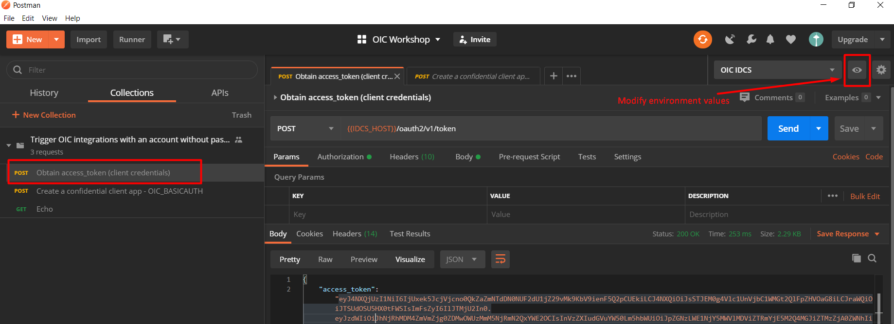
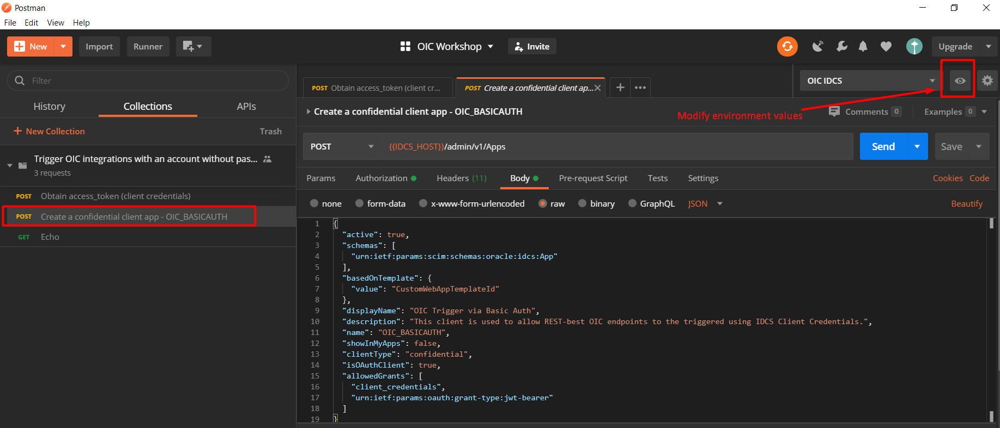

# Trigger OIC endpoints with a service account without password expiration

Authentication and authorization in Oracle Integration (OIC) is managed by Oracle Identity Cloud Service (IDCS).

Oracle Integration REST APIs as well as REST endpoints exposed in integrations are by default protected and require authentication and authorization.

OIC supports authentication with a service account in which the password does not expire, by using an IDCS confidential application.

- [Creating a service account for OIC](#creating-a-service-account-for-oic)
- [Best Practices](#best-practices)
- [References](#references)
--------------------------------------------------------------------------------------

## Creating a service account for OIC

The service account is implemented as an IDCS confidential application.

By enabling the application with Client Credentials and JWT Assertion, the CLIENT_ID and CLIENT_SECRET can be used for Basic Authentication. The CLIENT_SECRET does not expire and can be regenerated on demand.

The method is described in the OIC documentation, [here](https://docs.oracle.com/en/cloud/paas/integration-cloud/integration-cloud-auton/use-service-integration-account-no-password-expiration.html).

### Prerequisites
- A user with IDCS administrator role.
- An OIC instance.
- A user with administrator role for the OIC instance.
- Import the Collection and Environment in Postman
- Modify the Environment and set the values for the variables.

### Step 1. Create an IDCS Administrator Application
1. Login to IDCS as a user with IDCS administrator role.
1. Create a Confidential Application
    1. Name: OIC IDCS Administrator
    1. Allowed Grant Types: Client Credentials, Refresh Token
    1. Client Configuration > Token Issuance Policy > Grant the client access to Identity Cloud Service Admin APIs > App Roles: Identity Domain Administrator
    1. Note the Client ID and Client Secret: ${SA_CLIENT_ID} and ${SA_CLIENT_SECRET}
1. Activate the Application
1. Obtain an access token by using the Postman Collection. __Request:__ Obtain access_token (client credentials)

### Step 2. Create an OIC Client Application
Create a Confidential Application, by using the Postman Collection. __Request:__ Create a confidential client app - OIC_BASICAUTH

Description
- Display Name: OIC Trigger via Basic Auth
- Name: OIC_BASICAUTH. NB! According to OIC documentation, you have to use the suffix \_BASICAUTH. Empiric observation: OIC invocation fails with a 401-Unauthorized exception if the suffix is different.
- Allowed Grant Types: Client Credentials, JWT Assertion
- Note the Client ID and Client Secret: ${ST_CLIENT_ID} and ${ST_CLIENT_SECRET}

### Step 3. Grant the role ServiceUser to the OIC Client Application

1. Login to IDCS as a user with administrator role for the OIC instance.
2. Open the Application of the OIC instance, typically named OICINST_\<InstanceName\>.
3. Alternative to Steps 1 and 2 is to open the application by clicking on the IDCS Application link, available on the OIC instance overview.
4. Go to Application Roles > ServiceUser and assign the OIC Client Application.

N.B. The ServiceUser role can invoke both the Oracle Integration REST APIs as well as REST endpoints exposed in integrations.
A similar setup can be used to create an Application to be used with the ServiceInvoker role, which gives access only to the REST endpoints exposed in integrations.

### Step 4. Test an OIC integration
Use the Postman Collection to invoke an OIC integration. The sample Echo is included in the collection.
Choose Authorization type: Basic Authentication with Username: ${ST_CLIENT_ID} and Password: ${ST_CLIENT_SECRET}.
Request: Echo

--------------------------------------------------------------------------------------

## Disclaimer
- Having a service account without password expiration can raise security issues. Always be careful when using this approach and avoid sharing the service account credentials (client id and client secret) with human users.
- The service account without password expiration can help with the OIC connectivity agent, which supports only basic authentication and can benefit from the service account.
- Regenerate the CLIENT_SECRET for the service accounts, as needed based on your organization's security strategy.
- Whenever possible, use more secure authentication mechanisms. For human users, continue using basic authentication and password policies such as expiration and locking after unsuccessful login. OIC supports also OAuth 2.0, which you can leverage for machine-to-machine or system-to-system integrations.

--------------------------------------------------------------------------------------

## References
- Oracle Cloud Documentation > Administering Oracle Integration > [Use the Service Integration Account with No Password Expiration](https://docs.oracle.com/en/cloud/paas/integration-cloud/integration-cloud-auton/use-service-integration-account-no-password-expiration.html)
- IDCS REST APIs [Postman Collection](https://github.com/oracle/idm-samples/tree/master/idcs-rest-clients)
- https://www.ateam-oracle.com/trigger-oic-integration-using-oauth-client-credentials